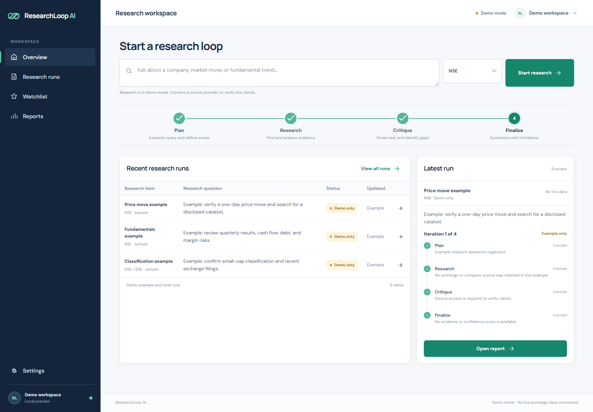
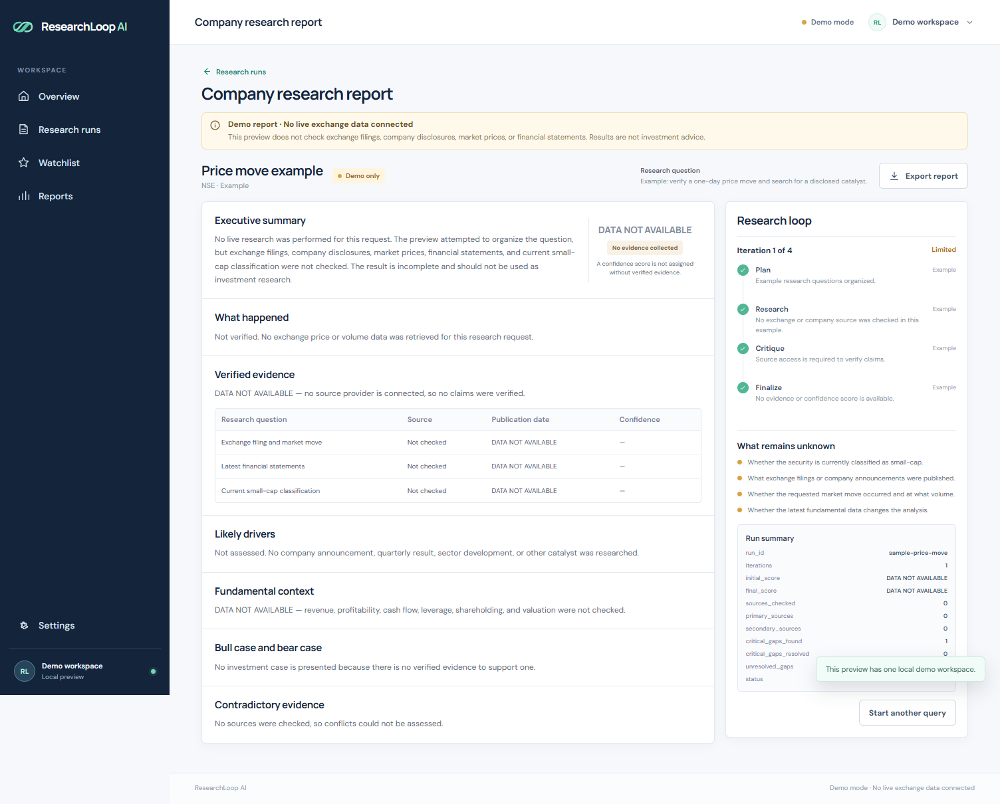

# 🚀 RESEARCHLOOP AI — MASTER SELF-CORRECTING LOOP PROMPT

A responsive, evidence-first research workspace prototype for Indian listed companies.

## Preview





## Run locally

Python 3 is sufficient; no package installation is needed.

```powershell
python -m http.server 4173
```

Open `http://localhost:4173` in a browser.

## Demo behavior

- Research questions move through the Plan, Research, Critique, and Finalize stages.
- With no live data provider configured, a run ends as **Limited** after recording that zero sources were checked and one critical data gap remains.
- Reports use `DATA NOT AVAILABLE` where verified evidence would be required. No market prices, financial metrics, or confidence scores are invented.
- Run history and watchlist symbols are stored in the current browser only.
- Report and run-list exports download JSON summaries.

This preview does not connect to NSE, BSE, company investor relations, financial databases, or an AI research API. Add server-side source integrations before using it for current market research.

## GitHub Pages

The repository publishes directly from the `main` branch root. Changes pushed to `main` update the site automatically.
